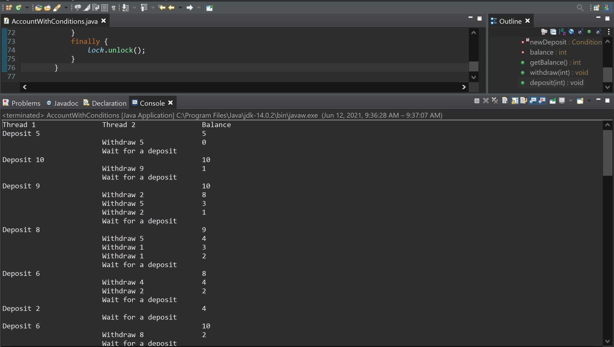

# Java Multithreaded Banking App

A robust, thread-safe banking application that demonstrates concurrent programming principles in Java. The application simulates a banking system where multiple threads simultaneously handle deposits and withdrawals while maintaining transaction consistency and preventing race conditions.

## 🎯 Features

- **Thread-Safe Operations**: Secure handling of concurrent deposits and withdrawals
- **Lock-Based Synchronization**: Uses `ReentrantLock` for thread coordination
- **Condition Variables**: Implements `Condition` for thread communication
- **Random Transaction Amounts**: Simulates real-world random deposit and withdrawal scenarios
- **Deadlock Prevention**: Fair locking mechanism to prevent thread starvation
- **Real-time Balance Updates**: Immediate balance reflection after each transaction

## 🔧 Technical Implementation

### Concurrency Mechanisms
- `ReentrantLock` with fairness policy enabled
- `Condition` variables for thread synchronization
- `ExecutorService` for thread pool management
- Thread sleep simulation for deposit operations
- Automated thread shutdown handling

### Key Components

#### Account Class
- Thread-safe balance management
- Conditional withdrawal processing
- Synchronized deposit handling
- Real-time balance tracking

#### Transaction Threads
- **Deposit Thread**: Generates random deposits (1-10 units) every second
- **Withdrawal Thread**: Attempts random withdrawals (1-10 units) continuously

## 🚀 Getting Started

### Prerequisites
- Java Development Kit (JDK) 8 or higher
- Java IDE (optional) - Eclipse, IntelliJ IDEA, or VS Code

### Running the Application

1. Clone the repository
```bash
git clone https://github.com/yourusername/java-multithreaded-banking.git
cd java-multithreaded-banking
```

2. Compile the application
```bash
javac AccountWithConditions.java
```

3. Run the application
```bash
java AccountWithConditions
```

## 📊 Sample Output

```
Thread 1         Thread 2         Balance
Deposit 5                        5
                Wait for a deposit
Deposit 3                        8
                Withdraw 6       2
Deposit 4                        6
                Withdraw 5       1
```



## 💡 Implementation Details

### Thread Synchronization
```java
private static Lock lock = new ReentrantLock(true);
private static Condition newDeposit = lock.newCondition();
```
- Fair lock ensures FIFO thread access
- Condition variable manages deposit-withdrawal coordination

### Deposit Processing
```java
public void deposit(int amount) {
    lock.lock();
    try {
        balance += amount;
        newDeposit.signalAll();
    }
    finally {
        lock.unlock();
    }
}
```

### Withdrawal Processing
```java
public void withdraw(int amount) {
    lock.lock();
    try {
        while(balance < amount) {
            newDeposit.await();
        }
        balance -= amount;
    }
    finally {
        lock.unlock();
    }
}
```

## 🔒 Thread Safety Features

1. **Atomic Operations**
   - All balance modifications occur within locked sections
   - Complete transaction isolation

2. **State Consistency**
   - Balance never goes negative
   - All withdrawals are fully backed by deposits

3. **Resource Management**
   - Proper lock release through `finally` blocks
   - Managed thread pool for controlled concurrency

## 🛠️ Project Structure
```
java-multithreaded-banking/
├── AccountWithConditions.java    # Main application file
├── README.md                     # Documentation
├── LICENSE.txt                   # License information
└── multithreaded_banking_app_demo.jpg  # Application demo
```

## 🤝 Contributing

1. Fork the repository
2. Create a feature branch (`git checkout -b feature/enhancement`)
3. Commit your changes (`git commit -am 'Add new feature'`)
4. Push to the branch (`git push origin feature/enhancement`)
5. Create a Pull Request

## 📄 License

This project is licensed under the MIT License - see the [LICENSE.txt](LICENSE.txt) file for details.

## 📚 Additional Resources

- [Java Concurrency in Practice](https://jcip.net/)
- [Oracle's Concurrency Tutorial](https://docs.oracle.com/javase/tutorial/essential/concurrency/)
- [Java Lock Documentation](https://docs.oracle.com/javase/8/docs/api/java/util/concurrent/locks/Lock.html)

## 📞 Contact

For questions and feedback, please open an issue in the repository.
